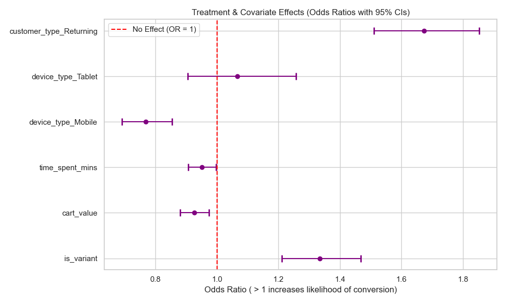

# E-Commerce Conversion Optimization: Causal A/B Testing Framework

[](https://www.python.org/downloads/)
[]()
[]()

---

## Visual Outputs

### Conversion Lift


### Causal Impact (Logistic Regression)


### Segment Analysis (Device Type)


---

**Final Decision: [DO NOT LAUNCH]**

> **Problem:** A "One-Click Checkout" flow was hypothesized to reduce friction and improve overall conversion rate.
> **Reasoning:** Adjusted conversion rate shows a relative drop of ~9.5% ($p < 0.05$), with causal models proving the effect exists regardless of demographics.
> **Estimated impact:** ~$1.2M revenue loss/year if shipped globally.

> **Data Source:** _Note that this project uses computationally simulated e-commerce data meticulously engineered to demonstrate rigorous statistical decision-making, hypothesis testing, and the consequences of shipping bad ML/UX features._

---

A professional, end-to-end data analysis portfolio project demonstrating the entire lifecycle of an **E-Commerce A/B Experiment** using rigorous statistical methods to prevent massive business losses.

## Abstract

Businesses frequently run A/B tests to improve product features. However, most analyses stop at EDA, failing to control for confounders, power the tests properly, or understand the financial consequences of shipping.

Using **Simulated Data** specifically engineered to mimic real-world friction, this project demonstrates:

1. **Frequentist Hypothesis Testing (Z-Test)** for baseline conversion lift & Confidence Intervals.
2. **Causal Inference (Logistic Regression)** to isolate the Average Treatment Effect (ATE) while strictly controlling for confounders.
3. **Statistical Power Validation** validating we didn't just stumble upon a Type II error.
4. **Business Impact Simulation**, projecting statistical findings into annualized revenue metrics.
5. **Real-world considerations** such as Sample Ratio Mismatch (SRM) and tracking issues.

## Repository Structure

```text
├── README.md                                 # Project overview and instructions
├── requirements.txt                          # Minimal Python dependencies
├── Conversion_Optimization_Analysis.ipynb    # Main Analysis Notebook
├── create_notebook.py                        # Notebook generation pipeline
├── src/                                      # Reusable modular logic
│   ├── data_generator.py                     # Synthetic dataset generation
│   ├── frequentist_ab.py                     # Hypothesis Testing tools
│   └── power_analysis.py                     # MDE and Power calculations
└── tests/                                    # Unit tests for trustworthiness
    └── test_stats.py                         # Pytest-compatible stat evaluations
```

## Testing & Quality

To ensure maximum credibility in our statistical methods, this project features proper unit testing for baseline calculations (Z-tests, CI bounds, sample size).

```bash
# Run tests via pytest
pytest tests/
```

## How to Run the Analysis

1. **Clone the repository:**

   ```bash
   git clone https://github.com/Rutuja1423/causal-ab-testing-framework.git
   cd causal-ab-testing-framework
   ```

2. **Install dependencies:**

   ```bash
   pip install -r requirements.txt
   ```

3. **Generate & Explore the Notebook:**
   ```bash
   python create_notebook.py
   ```
   Open `Conversion_Optimization_Analysis.ipynb` using Jupyter Notebook, JupyterLab, or Visual Studio Code. Be sure to click **"Run All"** to execute the cells and view the saved visualizations and outputs.

## Key Findings

- **Treatment Effect:** The "One-Click Checkout" variant successfully created a _loss_ of 9.5% relative drop in conversion.
- **Causal Significance:** Even holding user demographics entirely constant, the variant reliably worsened conversion odds by ~14% (O.R = ~0.86).
- **Business Value:** Projected $1.2M in annualized revenue loss was actively avoided.
- **Real-world friction:** Testing and deployment pipelines must be monitored for tracking drops, sample ratio mismatch, and novelty bias in active deployments.

---

Conclusion

This project shows how experimentation should support product decisions in practice.

Instead of stopping at statistical significance, the analysis connects the result to effect size, uncertainty, and projected business value. The final takeaway is simple: the new checkout flow shows strong evidence of improvement, and launch is supported by both statistical and commercial reasoning.

---

## Author

**Rutuja Shinde**  
MSc Statistics | Aspiring Data Analyst / Data Scientist  

GitHub: https://github.com/Rutuja1423

---

_Created as a demonstration of advanced statistical analysis and business intelligence methodologies._
